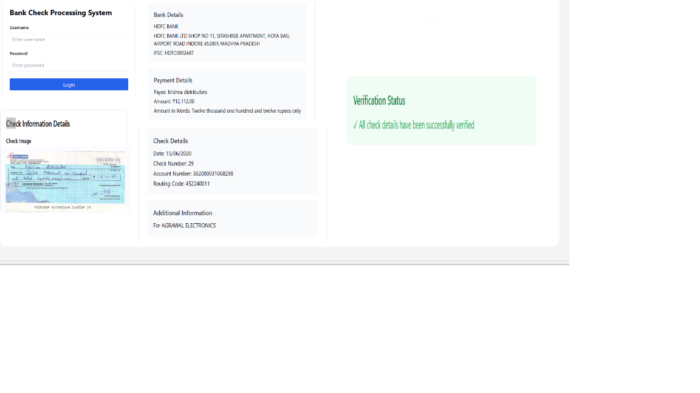

# 🧾 Automated Cheque Data Extraction System

> **AI-Powered Document Automation** using `YOLOv8` + `OCR`  
> 🚀 Speed up cheque processing. 🛡️ Ensure accuracy. ⚙️ Built for scalability.

---

## 🔍 Overview

An intelligent cheque-processing pipeline using **YOLOv8** for object detection and **OCR** for extracting printed and handwritten data from scanned cheques.

📌 **Use Cases**:  
- Automate cheque clearing in banks  
- Enable bulk data extraction from financial documents  
- Improve operational efficiency in high-volume document processing

---

## 🧰 Tech Stack

| Component         | Tech Used             |
|------------------|-----------------------|
| Object Detection | [YOLOv8 (Ultralytics)](https://docs.ultralytics.com) |
| OCR Engine       | [Tesseract OCR](https://github.com/tesseract-ocr/tesseract) |
| Image Handling   | OpenCV, Pillow         |
| Backend API      | FastAPI                |
| Data Export      | Pandas (Excel, CSV)    |

---

## 🧠 Core Features

- 🔎 **Region Detection with YOLOv8**  
  Locates critical cheque fields like:
  - Bank Name
  - Cheque Number
  - Date
  - IFSC Code
  - Amount
  - Account Number

- 🧾 **Text Extraction**
  - **Printed Fields**: High-accuracy OCR with Tesseract
  - **Handwritten Fields**: (Optional) Extendable for handwriting models

- 📊 **Data Structuring**
  - Outputs in `.xlsx` or `.json` formats
  - Pre-validated and standardized

---

## 🖼️ Sample Output (JSON)

```json
{
  "cheque_number": "123456",
  "date": "2025-06-21",
  "amount": "₹25,000",
  "account_number": "00123456789",
  "ifsc_code": "HDFC0001123"
}
```
## Screenshots



## Disclaimer

This is a simplified and sanitized frontend example for public demonstration only. It does not represent the full proprietary system used in production environments.
